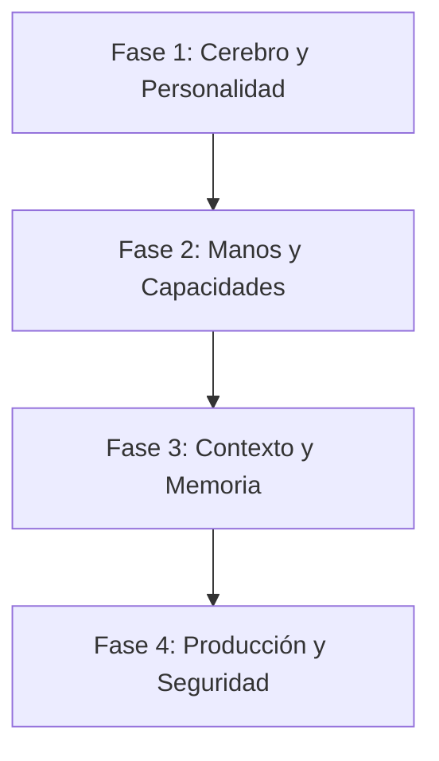

# 🤖 AI Engineering Playbook

> **"La autonomía se gana, no se otorga."**

Esta es la guía central de ingeniería para construir Agentes de IA y aplicaciones LLM-powered usando el Antigravity Stack. Conecta skills individuales en un workflow de producción cohesivo.

---

## 🏎️ El Ciclo de Vida del Agente

Construir un agente de grado de producción no es solo escribir un prompt. Requiere un enfoque disciplinado y en múltiples capas.

### 🔵 Fase 1: Cerebro & Personalidad (Diseño)

_Objetivo: Definir comportamiento, límites y estilo de razonamiento._

1. **Arquitecturar el Prompt**: No adivines. Usá **[`prompt-mastery`](prompt-mastery/SKILL.md)** para estructurar tus System Instructions u optimizar consultas dinámicamente con routing de frameworks en **[`prompt-engineer`](prompt-engineer/SKILL.md)**.
   - _Crítico_: Aplicá patrones de "Anti-Injection" desde el día uno.

2. **Optimizar el Razonamiento**: Si el agente necesita resolver problemas complejos, aplicá **[`prompt-mastery`](prompt-mastery/SKILL.md)** o los mappings de frameworks de **[`prompt-engineer`](prompt-engineer/SKILL.md)**.
   - Usá **Few-Shot Prompting** para enseñar con ejemplos.
   - Usá **Chain-of-Thought** para forzar lógica paso a paso antes de responder.

### 🟠 Fase 2: Manos & Herramientas (Capacidades)

_Objetivo: Permitir que el agente interactúe con el mundo de forma confiable._

1. **Diseñar la Interfaz**: El LLM no ve tu código; ve tus schemas. Usá **[`agent-tool-builder`](agent-tool-builder/SKILL.md)**.
   - _Regla_: Descripciones claras > Lógica compleja.
   - _Validación_: Cada tool debe tener un JSON Schema estricto.

2. **Conectar Servicios Externos**: Usá **[`mcp-builder`](mcp-builder/SKILL.md)** para envolver APIs (como GitHub, Slack o Bases de datos) en servidores estándar Model Context Protocol.

### 🟢 Fase 3: Memoria & Conocimiento (Contexto)

_Objetivo: Anclar al agente en la realidad y en tus datos específicos._

1. **Recuperar Conocimiento**: No dependas de los datos de entrenamiento del modelo. Construí un pipeline RAG usando **[`rag-expert`](rag-expert/SKILL.md)**.
   - _Crítico_: Implementá **Semantic Chunking** y **Hybrid Search** (Keywords + Embeddings).
   - _Obligatorio_: Siempre usá un paso de Reranker.

2. **Elección de Arquitectura**: Elegí la estructura correcta usando **[`ai-agents-architect`](ai-agents-architect/SKILL.md)**.
   - _ReAct_: Para tareas que requieren loops de razonamiento.
   - _Plan-Execute_: Para objetivos complejos de múltiples pasos.

### 🔴 Fase 4: Producción & Seguridad (Guardrails)

_Objetivo: Deployar sin noches de insomnio._

1. **Establecer Límites**: Usá los patrones de **[`ai-agents-architect`](ai-agents-architect/SKILL.md)**.
   - Implementá **Niveles de Permiso** (Auto vs. Preguntar al Usuario).
   - Establecé loops `max_iterations` estrictos para evitar gasto infinito.

2. **Creación de Nuevas Skills**: Si descubrís un nuevo patrón reutilizable durante el desarrollo, creá una nueva skill usando la metodología en **[`meta-skill-antigravity`](meta-skill-antigravity/SKILL.md)**.

---

## 📚 Índice de Skills

| Skill | Área de Enfoque | Cuándo usar |
| :--- | :--- | :--- |
| **[`prompt-mastery`](prompt-mastery/)** | Prompt Engineering | Optimizar prompts, Chain-of-Thought, templates |
| **[`prompt-engineer`](prompt-engineer/)** | Frameworks de Prompt | Transformar requests genéricos usando RTF, RISEN, RODES, etc. |
| **[`agent-tool-builder`](agent-tool-builder/)** | Tools & Functions | Diseño de JSON schemas para function calling |
| **[`ai-agents-architect`](ai-agents-architect/)** | Confiabilidad del Agente | Construir loops, sistemas de memoria, checks de seguridad y orquestación multi-agente |
| **[`rag-expert`](rag-expert/)** | Conocimiento/RAG | Construir pipelines de recuperación, chunking, reranking |
| **[`mcp-builder`](mcp-builder/)** | Conectividad | Crear servidores MCP para herramientas externas |
| **[`meta-skill-antigravity`](meta-skill-antigravity/)** | Metodología | Crear y validar nuevas skills |
| **[`elon-musk`](elon-musk/)** | Simulación | Simulación de persona para toma de decisiones estratégicas |
