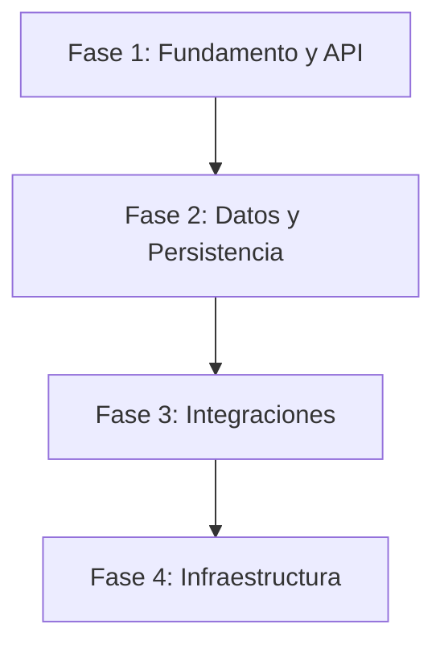

# ⚙️ Playbook de Ingeniería Backend

> **"La escalabilidad no es un feature; es una decisión de arquitectura."**

Este playbook te guía en la construcción de sistemas backend robustos y escalables. Va desde la arquitectura de alto nivel hasta optimizaciones específicas de base de datos y decisiones de infraestructura.

---

## 🏗️ El Ciclo de Vida del Backend

Un buen backend se construye en capas, desde el contrato de la API hasta el metal (contenedores).

### 🏰 Fase 1: Fundamento y Arquitectura

_Objetivo: Definir cómo se comunica el sistema y cómo organiza su lógica._

1.  **Definir el Contrato**: Antes de escribir código, definí la interfaz usando **[`api-patterns`](api-patterns/SKILL.md)**.
    - _Estándar_: ¿REST o GraphQL? ¿Estrategia de versionado?
    - _Restricción_: Siempre definí primero los formatos de los sobres de error (error envelopes).

2.  **Elegir el Framework y Estándares**:
    - **General/Node.js**: Usá **[`nodejs-best-practices`](../languages-standards/nodejs-best-practices/SKILL.md)** para el runtime, la selección del framework (Hono/Fastify/Express) y los estándares de arquitectura en capas.
    - **Enterprise**: Usá **[`nestjs-expert`](nestjs-expert/SKILL.md)** para aplicaciones estructuradas y modulares. Forzá la Inyección de Dependencias y separá estrictamente los Controladores de los Servicios.

### 💾 Fase 2: Datos y Persistencia

_Objetivo: Almacenar datos de forma confiable y eficiente._

1.  **Diseñar el Esquema**: Usá **[`database-design`](database-design/SKILL.md)** antes de ejecutar `CREATE TABLE`.
    - _Normalización_: 3NF por defecto, desnormalizá únicamente para hotspots con alta carga de lectura.
    - _Claves_: ¿UUIDs o Integers? Las restricciones de Clave Foránea (Foreign Key) son obligatorias.
    - _ORM_: Usá **[`prisma-expert`](prisma-expert/SKILL.md)** para migraciones, relaciones y consultas específicas de Prisma.

2.  **Optimizar el Motor**: Si usás PostgreSQL (recomendado), aplicá **[`postgres-best-practices`](postgres-best-practices/SKILL.md)**.
    - _Rendimiento_: Estrategias de indexación (B-Tree, GIN para JSONB).
    - _Seguridad_: Configuración de autovacuum y pool de conexiones (PgBouncer).

### 🔌 Fase 3: Integraciones

_Objetivo: Comunicarse con el mundo exterior._

1.  **Ecosistemas Externos**: Al conectarte con terceros complejos, no reinventes la rueda.
    - **MercadoLibre**: Usá **[`mercadolibre-api`](mercadolibre-api/SKILL.md)** para manejar la autenticación (OAuth) y los límites de rate limit específicos del ecosistema de MELI.

### 🐳 Fase 4: Infraestructura, DevOps y Seguridad

_Objetivo: Ejecutar en cualquier lugar de manera consistente y segura._

1.  **Contenedorizar**: "Funciona en mi máquina" es inaceptable. Usá **[`docker-expert`](docker-expert/SKILL.md)**.
    - _Optimización_: Builds multi-etapa (multi-stage) para lograr imágenes livianas.
    - _Orquestación_: Docker Compose para desarrollo local, adaptado para estar listo para producción.

2.  **Fortalecimiento y Modelado de Amenazas**: Realizá auditorías enfocadas en las superficies de ataque del backend usando **[`security-audit`](security-audit/SKILL.md)**.
    - _Análisis_: Comprobá fugas de datos de multi-tenancy, guards de autenticación de APIs, firmas de webhooks y exposición de datos en capas de serialización.
    - _Bloqueo_: Un hallazgo crítico en RLS o guards detendrá el workflow automatizado de cierre de epics.

---

## 📚 Índice de Skills

| Skill | Área de Enfoque | Cuándo usar |
| :--- | :--- | :--- |
| **[`api-patterns`](api-patterns/)** | Diseño de APIs | Definición de contratos REST/GraphQL, versionado, manejo de errores |
| **[`nestjs-expert`](nestjs-expert/)** | Framework Node.js | Construcción de aplicaciones escalables con NestJS |
| **[`prisma-expert`](prisma-expert/)** | ORM | Trabajo con Prisma, modelado de bases de datos, migraciones y consultas |
| **[`database-design`](database-design/)** | Modelado de Datos | Diseño de esquemas, selección de bases de datos y normalización |
| **[`postgres-best-practices`](postgres-best-practices/)** | Especificidades de BD | Optimización, indexación y características avanzadas de PostgreSQL/Supabase |
| **[`mercadolibre-api`](mercadolibre-api/)** | Integración | Conexión con las APIs de MercadoLibre (MELI) |
| **[`docker-expert`](docker-expert/)** | DevOps | Contenedorización, Dockerfiles, docker-compose |
| **[`security-audit`](security-audit/)** | Seguridad | Modelado de amenazas, auditorías de RLS multi-tenant y chequeo de guards de APIs |
