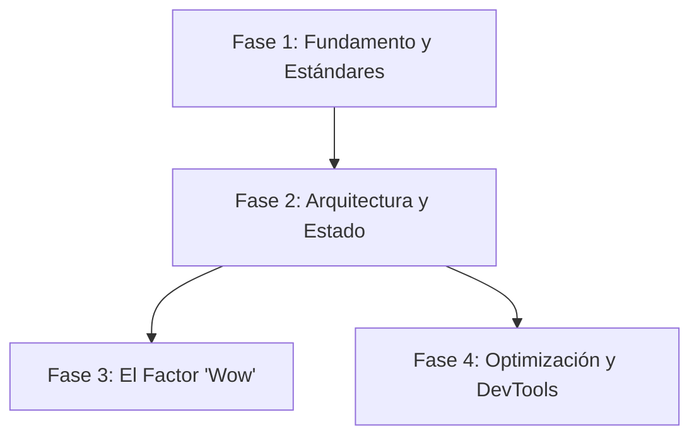

# 🎨 Playbook de Ingeniería Frontend

> **"Una interfaz de usuario es una promesa. El rendimiento es la entrega."**

Este playbook conecta los puntos entre construir arquitecturas escalables en React y crear experiencias de usuario que digan "WOW".

---

## 运作 El Ciclo de Vida del Frontend

El desarrollo frontend moderno es un equilibrio entre el Diseño de Sistemas (Lógica) y la Dirección Creativa (Emoción).

### 🧱 Fase 1: Fundamento y Estándares

_Objetivo: Escribir código que no se pudra._

1.  **Establecer las Reglas**: Comenzá con **[`frontend-dev-guidelines`](frontend-dev-guidelines/SKILL.md)** y las pautas generales de **[`frontend-developer`](frontend-developer/SKILL.md)**. Para andamiaje (scaffolding) de proyectos, generación de componentes y análisis de bundles, consultá **[`senior-frontend`](senior-frontend/SKILL.md)**.
    - _Principle Core_: Colocación > Tipo de Archivo. Mantené estilos, tipos, tests y lógica juntos.
    - _Tipografía_: Definí tu escala tipográfica temprano.

2.  **Estilo a Escala**: No escribas CSS puro. Usá **[`tailwind-patterns`](tailwind-patterns/SKILL.md)**.
    - _Regla_: Evitá el abuso de `@apply`. Usá clases de utilidad directamente en el marcado para mayor transparencia.
    - _Configuración_: Definí tus colores y espaciado en la configuración del tema para forzar el sistema de diseño.

### 🏛️ Fase 2: Arquitectura y Estado

_Objetivo: Manejar la complejidad sin ahogarse en prop drilling._

1.  **Elección de Framework**: Si estás construyendo un producto, usá **[`nextjs-best-practices`](nextjs-best-practices/SKILL.md)** por defecto.
    - _Arquitectura_: Usá patrones específicos de App Router (Server Components para datos, Client Components para interacción).

2.  **Gestión de Estado**: Seguí la guía completa en **[`react-state-management`](react-state-management/SKILL.md)** para seleccionar el enfoque adecuado (estado local, estado global, estado del servidor).
    - _Estado Local y Lógica Core_: **[`react-patterns`](react-patterns/SKILL.md)** cubre Hooks, Composición y estándares de React 19.
    - _Estado del Servidor_: Usá **[`tanstack-query-expert`](tanstack-query-expert/SKILL.md)** para gestionar el caché del estado del servidor, consultas (queries) y mutaciones.
    - _Estado Global_: Dejá de usar boilerplate de Redux. Usá **[`redux-migration-rtk-zustand`](redux-migration-rtk-zustand/SKILL.md)** para migrar a Redux Toolkit o Zustand.

### ✨ Fase 3: El Factor 'Wow' (UI/UX)

_Objetivo: Convertir a los usuarios en fanáticos._

1.  **Sistema de Diseño y Estilado**: Usá **[`design-it`](design-it/SKILL.md)** para enrutar el diseño de tu interfaz a uno de los 48 estilos visuales sofisticados.
    - _Primitivos_: Integrá componentes de **[`shadcn`](shadcn/SKILL.md)** para obtener bloques de interfaz de usuario accesibles y parametrizables.
    - _Layouts_: Aplicá **[`react-ui-patterns`](react-ui-patterns/SKILL.md)** para layouts.
    - _Diseño de Dashboards_: Aplicá **[`dashboard-design`](dashboard-design/SKILL.md)** para implementar grillas limpias, modulares y legibles para pantallas analíticas y seguimiento de métricas.
    - _Material Design_: Aplicá **[`material-design`](material-design/SKILL.md)** al implementar las pautas de Material Design 3 en Web, SwiftUI, Flutter, React Native y Jetpack Compose.

2.  **Sensación Premium**: Aplicá **[`ui-ux-pro-max`](ui-ux-pro-max/SKILL.md)**.
    - _Micro-interacciones_: Feedback en cada clic.
    - _Estética_: Glassmorphism, gradientes modernos y "espacio para respirar" (whitespace).
    - _Mentalidad_: "Si se ve básico, fallaste."

3.  **Estrategia y Tokens de UI/UX Core**: Aplicá **[`ui-ux-designer`](ui-ux-designer/SKILL.md)** para investigación de usuarios, wireframing, sistemas de diseño (diseño atómico, variables) y convenciones de nombres basadas en tokens.

4.  **Diseño Espacial y de Movimiento**: Aplicá **[`antigravity-design-expert`](antigravity-design-expert/SKILL.md)** para interfaces ingrávidas, espaciales en 3D y basadas en glassmorphism usando GSAP y transformaciones 3D.

5.  **Magia y Micro-interacciones**: Usá **[`design-spells`](design-spells/SKILL.md)** para inyectar animaciones encantadoras, easter eggs y patrones de diseño interactivo ingeniosos que agreguen personalidad.

6.  **Documentación Interactiva**: Usá **[`web-artifacts-builder`](web-artifacts-builder/SKILL.md)** para construir dashboards y páginas de documentación interactiva autocontenidos basados en React que alimenten a Antigravity.

7.  **Experiencias 3D**: Usá **[`threejs-fundamentals`](threejs-fundamentals/SKILL.md)** para configurar escenas WebGL/WebGPU, cámaras/renderizadores, jerarquías y aplicar consejos de optimización para elementos 3D responsivos.

### 🔄 Fase 4: Optimización, Debugging y Migraciones

_Objetivo: Reducir la deuda técnica y depurar producción de forma segura._

1.  **Debugging y Rendimiento**: Al escribir componentes, implementar data fetching o auditar problemas de rendimiento, seguí las optimizaciones de Vercel en **[`react-best-practices`](react-best-practices/SKILL.md)**. Para debugging en producción, usá **[`nextjs-production-debugger`](nextjs-production-debugger/SKILL.md)** o **[`ui-review-nextjs-tailwind`](ui-review-nextjs-tailwind/SKILL.md)**, y verificá los estándares contra **[`web-design-guidelines`](web-design-guidelines/SKILL.md)**.
    - _SSR vs CSR_: Identificá si el error está del lado del servidor o del cliente.
    - _Hydration_: Corregí los errores de discordancia de texto (text mismatch).
    - _Rendimiento_: Auditá cascadas (waterfalls) y tamaño del bundle.

2.  **Auditorías de Accesibilidad**: Realizá auditorías con **[`accessibility-audit`](accessibility-audit/SKILL.md)**, ejecutá auditorías WCAG 2.2 usando **[`wcag-audit-patterns`](wcag-audit-patterns/SKILL.md)**, enfocate en auditorías de componentes StyleSeed mobile-first usando **[`ui-a11y`](ui-a11y/SKILL.md)**, o automatizá la auditoría y corrección usando **[`accesslint-audit`](accesslint-audit/SKILL.md)**.
    - _Soluciones_: Priorizá HTML semántico antes que ARIA y verificá que los targets de toque sean >=44x44px.

3.  **Configuración de PWA**: Convertí tu aplicación en una experiencia móvil instalable con **[`progressive-web-app`](progressive-web-app/SKILL.md)**.

4.  **Ruta de Actualización**: Migrá de forma segura a React 19 usando **[`react-migration-16-to-19`](react-migration-16-to-19/SKILL.md)**.

---

## 📚 Índice de Skills

| Skill | Enfoque | Objetivo | Cuándo usar |
| :--- | :--- | :--- | :--- |
| **[`design-it`](design-it/)** | Visuales | Enrutar diseño a 48 opiniones | Seleccionar estéticas de diseño premium específicas |
| **[`dashboard-design`](dashboard-design/)** | Layouts | Grillas enfocadas en analítica | Construir dashboards de métricas responsivos (web/móvil) |
| **[`material-design`](material-design/)** | Sistemas de Diseño | Pautas de Material Design 3 | Construir interfaces siguiendo las especificaciones de Material en web y plataformas móviles |
| **[`ui-ux-pro-max`](ui-ux-pro-max/)** | Estética | Crear interfaces premium | Pulir la interfaz de usuario para lograr el factor wow |
| **[`ui-ux-designer`](ui-ux-designer/)** | Estrategia/UX | Investigación y tokens de diseño | Pautas de diseño de sistemas de alto nivel y estrategia UX multiplataforma |
| **[`antigravity-design-expert`](antigravity-design-expert/)** | Espacial y Movimiento | 3D ingrávido y glassmorphism | Landing pages inmersivas, dashboards y movimiento con GSAP |
| **[`threejs-fundamentals`](threejs-fundamentals/)** | Espacial/Movimiento | Configuración de escenas Three.js | Escenas WebGL/WebGPU básicas, configuración de cámaras, renderizado y sistemas de coordenadas |
| **[`design-spells`](design-spells/)** | Spells/UX | Micro-interacciones y Easter eggs | Pulir componentes terminados para agregar wow y magia |
| **[`frontend-dev-guidelines`](frontend-dev-guidelines/)** | Estándares | Consistencia en el equipo | Iniciar un nuevo proyecto o incorporación (onboarding) |
| **[`senior-frontend`](senior-frontend/)** | Arquitectura/QA | Andamiaje de componentes y análisis de bundles | Scaffolding de apps Next.js, generación de componentes server/client y análisis de tamaño de bundle |
| **[`frontend-developer`](frontend-developer/)** | Lógica/UI | Estructura de componentes | Implementar componentes frontend |
| **[`accessibility-audit`](accessibility-audit/)** | Accesibilidad | Cumplimiento de WCAG y pruebas de teclado | Auditar y solucionar barreras de accesibilidad |
| **[`ui-a11y`](ui-a11y/)** | Accesibilidad/UI | Auditoría de componentes StyleSeed WCAG 2.2 AA | Auditar y corregir automáticamente controles interactivos móviles |
| **[`wcag-audit-patterns`](wcag-audit-patterns/)** | Accesibilidad | Guía y checklists de auditoría WCAG 2.2 | Auditar layouts y formularios para cumplimiento de WCAG |
| **[`accesslint-audit`](accesslint-audit/)** | Accesibilidad/Correcciones | Loops de auditoría y autocorrección WCAG 2.2 | Corregir código o páginas usando CDP o HTML estático |
| **[`nextjs-best-practices`](nextjs-best-practices/)** | Framework | Arquitectura escalable | Construir nuevas aplicaciones con App Router |
| **[`nextjs-production-debugger`](nextjs-production-debugger/)** | Correcciones | Estabilidad en producción | Depurar bugs de SSR/CSR o lentitud |
| **[`ui-review-nextjs-tailwind`](ui-review-nextjs-tailwind/)** | Revisión | Auditoría de código y diseño | Auditar layout y rendimiento antes de subir a producción |
| **[`web-design-guidelines`](web-design-guidelines/)** | Lineamientos | Verificación de pautas de interfaz web | Chequear layout, estilos y código contra estándares |
| **[`react-best-practices`](react-best-practices/)** | Rendimiento | Optimizaciones de Vercel para React/Next.js | Auditar cascadas, tamaño de bundles, caché y renderizado |
| **[`react-state-management`](react-state-management/)** | Estado | Patrones modernos de gestión de estado | Configuración, criterios de selección (RTK, Zustand, Jotai, React Query) y arquitectura de slices |
| **[`react-patterns`](react-patterns/)** | Lógica | Hooks y patrones reutilizables | Escribir lógica compleja de componentes |
| **[`tailwind-patterns`](tailwind-patterns/)** | Estilado | CSS mantenible | Refactorizar clases de Tailwind desordenadas |
| **[`shadcn`](shadcn/)** | Componentes | Partes accesibles y reutilizables | Diseñar la arquitectura de bloques de UI |
| **[`tanstack-query-expert`](tanstack-query-expert/)** | Estado del Servidor | Sincronización de datos | Gestionar consultas y mutaciones asincrónicas del servidor |
| **[`redux-migration-rtk-zustand`](redux-migration-rtk-zustand/)** | Estado | Gestión de estado moderna | Migrar código heredado (legacy) de Redux |
| **[`react-migration-16-to-19`](react-migration-16-to-19/)** | Legacy | Pago de deuda técnica | Actualizar bases de código antiguas de React |
| **[`react-ui-patterns`](react-ui-patterns/)** | Componentes | Estados de UI y Datos | Estados de carga, manejo de errores, estados vacíos y loaders de botones |
| **[`progressive-web-app`](progressive-web-app/)** | PWA | Instalabilidad de la aplicación | Empaquetar aplicaciones web como PWAs |
| **[`lovable-cleanup`](lovable-cleanup/)** | Limpieza | Eliminación de templates | Exportar código de Lovable Cloud |
| **[`web-artifacts-builder`](web-artifacts-builder/)** | Artefactos | Empaquetado de UIs autocontenidas | Construir páginas de documentación basadas en React para Antigravity |
