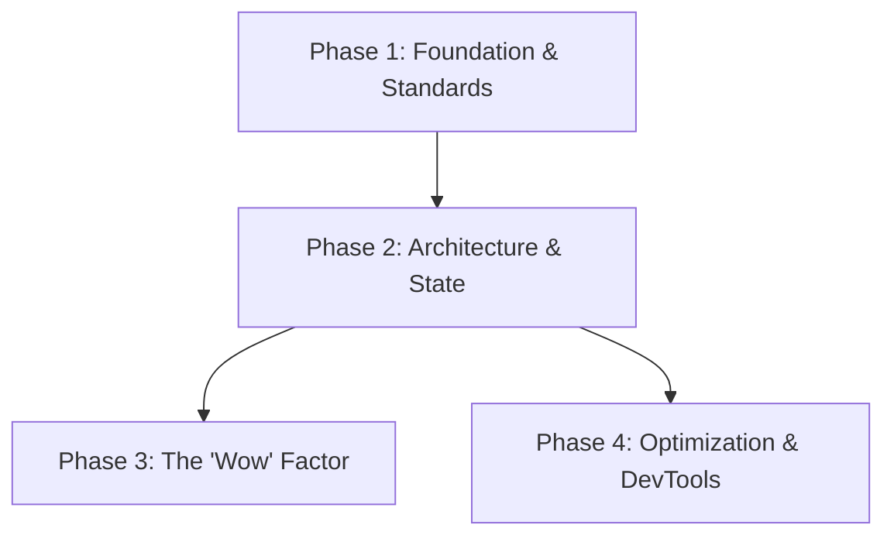

# 🎨 Frontend Engineering Playbook

> **"A UI is a promise. Performance is the delivery."**

This playbook connects the dots between building scalable React architectures and creating "WOW" user experiences.

---

## 🖌️ The Frontend Lifecycle

Modern frontend development is a balance between System Design (Logic) and Creative Direction (Emotion).

### 🧱 Phase 1: Foundation & Standards

_Goal: Write code that doesn't rot._

1.  **Set the Rules**: Start with **[`frontend-dev-guidelines`](frontend-dev-guidelines/SKILL.md)** and general **[`frontend-developer`](frontend-developer/SKILL.md)** guidelines.
    - _Core Principle_: Colocation > File Type. Keep styles, types, tests, and logic together.
    - _Typography_: Define your scale early.

2.  **Style at Scale**: Don't write raw CSS. Use **[`tailwind-patterns`](tailwind-patterns/SKILL.md)**.
    - _Rule_: Avoid `@apply` abuse. Use utility classes directly in markup for transparency.
    - _Config_: Define your colors/spacing in theme configuration to enforce the design system.

### 🏛️ Phase 2: Architecture & State

_Goal: Manage complexity without drowning in prop drilling._

1.  **Framework Choice**: If building a product, default to **[`nextjs-best-practices`](nextjs-best-practices/SKILL.md)**.
    - _Architecture_: Use App Router specific patterns (Server Components for data, Client Components for interaction).

2.  **State Management**:
    - _Local State & Core Logic_: **[`react-patterns`](react-patterns/SKILL.md)** covers Hooks, Composition, and React 19 standards.
    - _Server State_: Use **[`tanstack-query-expert`](tanstack-query-expert/SKILL.md)** to manage server state caching, queries, and mutations.
    - _Global State_: Stop using Redux boilerplate. Use **[`redux-migration-rtk-zustand`](redux-migration-rtk-zustand/SKILL.md)** to switch to Redux Toolkit or Zustand.

### ✨ Phase 3: The 'Wow' Factor (UI/UX)

_Goal: Turn users into fans._

1.  **Design System & Styling**: Use **[`design-it`](design-it/SKILL.md)** to route your interface design to one of the 48 sophisticated visual styles.
    - _Primitives_: Integrate **[`shadcn`](shadcn/SKILL.md)** components for accessible, themeable UI blocks.
    - _Layouts_: Apply **[`react-ui-patterns`](react-ui-patterns/SKILL.md)** for layouts.
    - _Dashboard Design_: Apply **[`dashboard-design`](dashboard-design/SKILL.md)** to implement clean, modular, and scannable grids for analytics-focused screens and metrics tracking.
    - _Material Design_: Apply **[`material-design`](material-design/SKILL.md)** when implementing Material Design 3 guidelines across Web, SwiftUI, Flutter, React Native, and Jetpack Compose.

2.  **Premium Feel**: Apply **[`ui-ux-pro-max`](ui-ux-pro-max/SKILL.md)**.
    - _Micro-interactions_: Feedback on every click.
    - _Aesthetics_: Glassmorphism, modern gradients, and "breathing room" (whitespace).
    - _Mindset_: "If it looks basic, you failed."

3.  **Core UI/UX Strategy & Tokens**: Apply **[`ui-ux-designer`](ui-ux-designer/SKILL.md)** for user research, wireframing, design systems (atomic design, variables), and token-based naming conventions.

4.  **Spatial & Motion Design**: Apply **[`antigravity-design-expert`](antigravity-design-expert/SKILL.md)** for weightless, 3D spatial, and glassmorphism-based interfaces using GSAP and 3D transforms.

5.  **Magic & Micro-interactions**: Use **[`design-spells`](design-spells/SKILL.md)** to inject delightful animations, easter eggs, and clever interactive design patterns that add personality.

6.  **Interactive Documentation**: Use **[`web-artifacts-builder`](web-artifacts-builder/SKILL.md)** to build self-contained React-based interactive dashboards and documentation pages that feed Antigravity.

### 🔄 Phase 4: Optimization, Debugging & Migrations

_Goal: Pay down technical debt and debug production safely._

1.  **Debugging & Performance**: When writing components, implementing data fetching, or auditing performance issues, follow Vercel's **[`react-best-practices`](react-best-practices/SKILL.md)**. For production debugging, use **[`nextjs-production-debugger`](nextjs-production-debugger/SKILL.md)** or **[`ui-review-nextjs-tailwind`](ui-review-nextjs-tailwind/SKILL.md)**, and check standards against **[`web-design-guidelines`](web-design-guidelines/SKILL.md)**.
    - _SSR vs CSR_: Identify if the bug is server-side or client-side.
    - _Hydration_: Fix text mismatch errors.
    - _Performance_: Audit waterfalls and bundle size.

2.  **Accessibility Audits**: Conduct audits with **[`accessibility-audit`](accessibility-audit/SKILL.md)**, execute WCAG 2.2 audits using **[`wcag-audit-patterns`](wcag-audit-patterns/SKILL.md)**, focus on mobile-first StyleSeed component audits using **[`ui-a11y`](ui-a11y/SKILL.md)**, or automate auditing and fixing using **[`accesslint-audit`](accesslint-audit/SKILL.md)**.
    - _Fixes_: Prioritize semantic HTML before ARIA, and verify touch targets (>=44x44px).

3.  **PWA Configuration**: Turn your app into an installable mobile experience with **[`progressive-web-app`](progressive-web-app/SKILL.md)**.

4.  **Upgrade Path**: Upgrade safely to React 19 using **[`react-migration-16-to-19`](react-migration-16-to-19/SKILL.md)**.

---

## 📚 Skill Index

| Skill | Focus | Goal | When to use |
| :--- | :--- | :--- | :--- |
| **[`design-it`](design-it/)** | Visuals | Routing design to 48 opinions | Selecting specific premium layout aesthetics |
| **[`dashboard-design`](dashboard-design/)** | Layouts | Analytics-focused grids | Building responsive metrics dashboards (web/mobile) |
| **[`material-design`](material-design/)** | Design Systems | Material Design 3 guidelines | Building interfaces following Material specs across web and mobile platforms |
| **[`ui-ux-pro-max`](ui-ux-pro-max/)** | Aesthetics | Creating premium interfaces | Polishing UI for wow factor |
| **[`ui-ux-designer`](ui-ux-designer/)** | Strategy/UX | User research & design tokens | High-level system design guidelines and cross-platform UX strategy |

| **[`antigravity-design-expert`](antigravity-design-expert/)** | Spatial & Motion | Weightless 3D & glassmorphism | Immersive landing pages, dashboards, and GSAP motion |
| **[`design-spells`](design-spells/)** | Spells/UX | Micro-interactions & Easter eggs | Polishing completed components to add wow factor and magic |
| **[`frontend-dev-guidelines`](frontend-dev-guidelines/)** | Standards | Consistency across team | Starting new project/onboarding |
| **[`frontend-developer`](frontend-developer/)** | Logic/UI | Component structure | Implementing frontend components |
| **[`accessibility-audit`](accessibility-audit/)** | Accessibility | WCAG compliance & keyboard testing | Auditing and fixing accessibility barriers |
| **[`ui-a11y`](ui-a11y/)** | Accessibility/UI | WCAG 2.2 AA StyleSeed component audit | Auditing and autofixing mobile-first interactive controls |
| **[`wcag-audit-patterns`](wcag-audit-patterns/)** | Accessibility | WCAG 2.2 audit guide & checklists | Auditing layouts and forms for WCAG compliance |
| **[`accesslint-audit`](accesslint-audit/)** | Accessibility/Fixes | WCAG 2.2 audit and autofix loops | Fixing codebases/pages using CDP or static HTML |
| **[`nextjs-best-practices`](nextjs-best-practices/)** | Framework | Scalable architecture | Building new App Router apps |
| **[`nextjs-production-debugger`](nextjs-production-debugger/)** | Fixes | Production stability | Debugging SSR/CSR bugs or slowness |
| **[`ui-review-nextjs-tailwind`](ui-review-nextjs-tailwind/)** | Review | Design & code audit | Auditing layout and performance before shipping |
| **[`web-design-guidelines`](web-design-guidelines/)** | Guidelines | Web Interface Guidelines verification | Checking layout, styling, and code against standards |
| **[`react-best-practices`](react-best-practices/)** | Performance | Vercel React/Next.js optimizations | Auditing waterfalls, bundle size, caching, and rendering |
| **[`react-patterns`](react-patterns/)** | Logic | Reusable hooks/patterns | Writing complex component logic |
| **[`tailwind-patterns`](tailwind-patterns/)** | Styling | Maintainable CSS | Refactoring messy tailwind classes |

| **[`shadcn`](shadcn/)** | Components | Reusable accessible parts | Designing UI block architecture |
| **[`tanstack-query-expert`](tanstack-query-expert/)** | Server State | Data synchronization | Managing async server queries and mutations |
| **[`redux-migration-rtk-zustand`](redux-migration-rtk-zustand/)** | State | Modern state management | Moving away from legacy Redux |
| **[`react-migration-16-to-19`](react-migration-16-to-19/)** | Legacy | Paying technical debt | Upgrading old React codebases |
| **[`react-ui-patterns`](react-ui-patterns/)** | Components | Layout patterns | Building consistent structures |
| **[`progressive-web-app`](progressive-web-app/)** | PWA | App installability | Packaging web apps as PWAs |
| **[`lovable-cleanup`](lovable-cleanup/)** | Cleanup | Stripping templates | Exporting code from Lovable Cloud |
| **[`web-artifacts-builder`](web-artifacts-builder/)** | Artifacts | Bundling self-contained UIs | Building React-based documentation pages for Antigravity |
