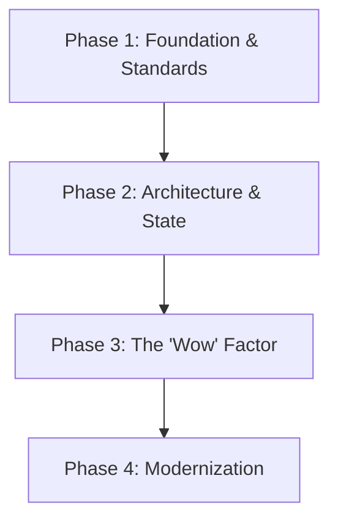

# 🎨 Frontend Engineering Playbook

> **"A UI is a promise. Performance is the delivery."**

This playbook connects the dots between building scalable React architectures and creating "WOW" user experiences.

---

## 🖌️ The Frontend Lifecycle

Modern frontend development is a balance between System Design (Logic) and Creative Direction (Emotion).

### 🧱 Phase 1: Foundation & Standards

_Goal: Write code that doesn't rot._

1.  **Set the Rules**: Start with **[`frontend-dev-guidelines`](frontend-dev-guidelines/SKILL.md)**.
    - _Core Principle_: Colocation > File Type. Keep styles, tests, and logic together.
    - _Typography_: Define your scale early.

2.  **Style at Scale**: Don't write raw CSS. Use **[`tailwind-patterns`](tailwind-patterns/SKILL.md)**.
    - _Rule_: Avoid `@apply` abuse. Use utility classes directly in markup for transparency.
    - _Config_: Define your colors/spacing in `tailwind.config.js` to enforce the design system.

### 🏛️ Phase 2: Architecture & State

_Goal: Manage complexity without drowning in prop drilling._

1.  **Framework Choice**: If building a product, default to **[`nextjs-best-practices`](nextjs-best-practices/SKILL.md)**.
    - _Architecture_: Use App Router specific patterns (Server Components for data, Client Components for interaction).

2.  **State Management**:
    - _Local State_: **[`react-frontend-patterns`](react-frontend-patterns/SKILL.md)** covers Hooks and Composition.
    - _Global State_: Stop using Redux boilerplate. Use **[`redux-migration-rtk-zustand`](redux-migration-rtk-zustand/SKILL.md)** to switch to Redux Toolkit or Zustand.

### ✨ Phase 3: The 'Wow' Factor (UI/UX)

_Goal: Turn users into fans._

1.  **Component Library**: Don't reinvent the Button. Use **[`react-ui-patterns`](react-ui-patterns/SKILL.md)** for accessible, composable primitives.

2.  **Premium Feel**: This is the differentiator. Apply **[`ui-ux-pro-max`](ui-ux-pro-max/SKILL.md)**.
    - _Micro-interactions_: Feedback on every click.
    - _Aesthetics_: Glassmorphism, modern gradients, and "breathing room" (whitespace).
    - _Mindset_: "If it looks basic, you failed."

3.  **Technical Challenges**: Preparing for exams or coding challenges? Use **[`react-exam-copilot`](react-exam-copilot/SKILL.md)**.
    - _Training Mode_: Full solutions with explanations.
    - _Exam Mode_: Guided hints without giving away answers.
    - _Checklists_: A11y, Performance, Testing, and Code Quality.

### 🔄 Phase 4: Modernization (Legacy)

_Goal: Pay down technical debt safely._

1.  **Upgrade Path**: Stuck on Class Components? Use **[`react-migration-16-to-19`](react-migration-16-to-19/SKILL.md)**.
    - _Strategy_: Strangler Pattern. Upgrade leaf components first.
    - _Strict Mode_: Enable it to catch unsafe lifecycles.

---

### 🚑 Phase 5: Production & Maintenance

_Goal: Keep the lights on and the users happy._

1.  **Debugging & Performance**: When things break in prod, use **[`nextjs-production-debugger`](nextjs-production-debugger/SKILL.md)**.
    - _SSR vs CSR_: Identify if the bug is server-side or client-side.
    - _Hydration_: Fix text mismatch errors.
    - _Performance_: Audit waterfalls and bundle size.

---

## 📚 Skill Index

| Skill                                                             | Focus      | Goal                        | When to use                        |
| :---------------------------------------------------------------- | :--------- | :-------------------------- | :--------------------------------- |
| **[`ui-ux-pro-max`](ui-ux-pro-max/)**                             | Aesthetics | Creating premium interfaces | Polishing UI for wow factor        |
| **[`frontend-dev-guidelines`](frontend-dev-guidelines/)**         | Standards  | Consistency across team     | Starting new project/onboarding    |
| **[`nextjs-best-practices`](nextjs-best-practices/)**             | Framework  | Scalable architecture       | Building new App Router apps       |
| **[`nextjs-production-debugger`](nextjs-production-debugger/)**   | Fixes      | Production stability        | Debugging SSR/CSR bugs or slowness |
| **[`react-frontend-patterns`](react-frontend-patterns/)**         | Logic      | Reusable hooks/patterns     | Writing complex component logic    |
| **[`react-exam-copilot`](react-exam-copilot/)**                   | Training   | Passing tech interviews     | Preparing for coding challenges    |
| **[`tailwind-patterns`](tailwind-patterns/)**                     | Styling    | Maintainable CSS            | Refactoring messy tailwind classes |
| **[`redux-migration-rtk-zustand`](redux-migration-rtk-zustand/)** | State      | Modern state management     | Moving away from legacy Redux      |
| **[`react-migration-16-to-19`](react-migration-16-to-19/)**       | Legacy     | Paying technical debt       | Upgrading old codebases            |
| **[`react-ui-patterns`](react-ui-patterns/)**                     | Components | Accessible primitives       | Building/using component library   |
