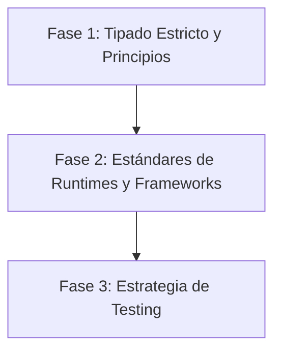

# 📏 Playbook de Código y Calidad

> **"Si no está tipado, no existe. Si no está testeado, está roto."**

Este playbook establece los estándares no negociables de calidad de código para todo el stack. Usá estas skills para escribir código que se documente a sí mismo y se resista a romperse.

---

## 🛡️ El Ciclo de Vida de la Calidad

La calidad no es una "fase de testing"; es un proceso continuo que comienza con la primera línea de código.

### 🔷 Fase 1: Tipado Estricto (La Primera Defensa)

_Objetivo: Detectar errores en tiempo de compilación, no en runtime._

1.  **TypeScript por Defecto**: No existe "Vanilla JS" en este stack. Usá **[`typescript-expert`](typescript-expert/SKILL.md)**.
    - _Sin `any`_: Usá `unknown` si es necesario y casteá de forma segura más adelante.
    - _Genéricos_: Aprendé a usar genéricos para crear utilidades reutilizables y type-safe.
    - _Zod/Valibot_: Usá validación en runtime en los extremos (entradas de API) y tipado estático internamente.

2.  **Filosofía Clean Code**: Aplicá las pautas de Uncle Bob con **[`clean-code`](clean-code/SKILL.md)**.
    - _Nombres Descriptivos_: Sin criptónimos ni variables de una sola letra.
    - _Responsabilidad Única_: Un método hace exactamente una cosa.

3.  **Conventional Commits**: Aplicá **[`commit`](commit/SKILL.md)** para formatear y escribir mensajes de commit limpios y semánticos bajo Conventional Commits antes de subir cambios.

### ⚙️ Fase 2: Estándares de Runtimes y Frameworks

_Objetivo: Elegir las herramientas de ejecución correctas y escribir código backend consistente._

1.  **Arquitectura Node.js**: Aplicá **[`nodejs-best-practices`](nodejs-best-practices/SKILL.md)** para seleccionar runtimes, diseñar controladores/servicios y manejar excepciones.

### 🧪 Fase 3: Estrategia de Testing (La Red de Seguridad)

_Objetivo: Dormir bien por las noches._

1.  **TDD y Mocking**: Usá **[`testing-patterns`](testing-patterns/SKILL.md)**.
    - _Unit Tests_: Testeá la lógica pura (utilidades, helpers) exhaustivamente con Vitest.
    - _Mocking_: Usá `vi.mock` para aislar los componentes bajo prueba.
    - _Factories_: Utilizá fábricas de datos simulados (mock data factories) para mantener los conjuntos de prueba secos (DRY).

---

## 📚 Índice de Skills

| Skill | Área de Enfoque | Cuándo usar |
| :--- | :--- | :--- |
| **[`typescript-expert`](typescript-expert/)** | Seguridad de Tipos | Tipos avanzados, genéricos, patrones de configuración estrictos |
| **[`clean-code`](clean-code/)** | Principios | Mejorar legibilidad, refactorizar lógica, diseño de clases |
| **[`software-architecture`](software-architecture/)** | Estándares de Código | Reglas de estilo de código, convenciones de nombres, enfoque library-first |
| **[`commit`](commit/)** | Git / Workflow | Formateo de Conventional Commits, git logs y orquestación híbrida |
| **[`nodejs-best-practices`](nodejs-best-practices/)** | Runtime/Arquitectura | Arquitectura backend de Node.js, frameworks, principios asincrónicos y de seguridad |
| **[`testing-patterns`](testing-patterns/)** | QA y TDD | Estrategias de pruebas unitarias/integración con Vitest, mocking, factories |
| **[`javascript-mastery`](javascript-mastery/)** | Fundamentos de JS | Más de 33 conceptos clave de JS: primitivos, closures, async, prototipos, ES6+ |
| **[`javascript-testing-patterns`](javascript-testing-patterns/)** | Estrategia de Testing | Patrones de pruebas unitarias, integración, E2E, de componentes, MSW, TDD y CI/CD |
| **[`modern-javascript-patterns`](modern-javascript-patterns/)** | Patrones ES6+ | Recetas de refactorización, migración asincrónica, pipelines funcionales, rendimiento |
