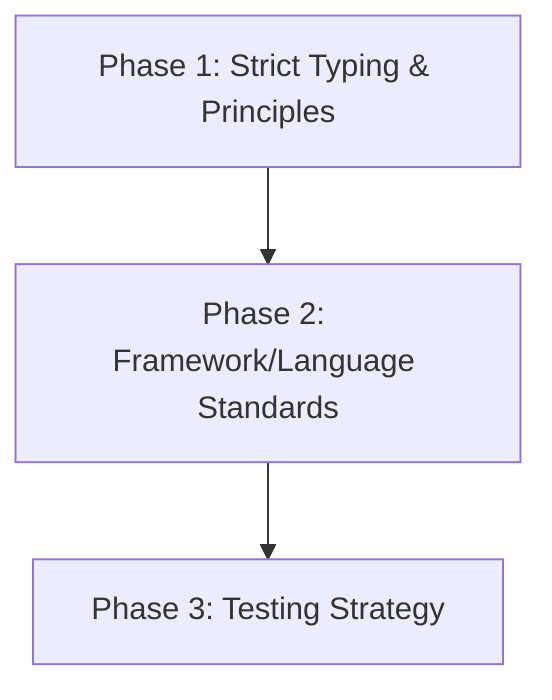

# 📏 Code & Quality Playbook

> **"If it's not typed, it doesn't exist. If it's not tested, it's broken."**

This playbook establishes the non-negotiable standards for code quality across the entire stack. Use these skills to write code that documents itself and refuses to break.

---

## 🛡️ The Quality Lifecycle

Quality isn't a "testing phase"; it's a continuous process that starts with the first line of code.

### 🔷 Phase 1: Strict Typing (The First Defense)

_Goal: Catch errors at compile time, not runtime._

1.  **TypeScript by Default**: There is no "Vanilla JS" in this stack. Use **[`typescript-expert`](typescript-expert/SKILL.md)**.
    - _No `any`_: Use `unknown` if you must, and cast safely later.
    - _Generics_: Learn to use generics to create reusable, type-safe utilities.
    - _Zod/Valibot_: Use runtime validation at the edges (API inputs), static typing internally.

2.  **Clean Code Philosophy**: Apply Uncle Bob's guidelines with **[`clean-code`](clean-code/SKILL.md)**.
    - _Descriptive Naming_: No cryptonyms or single letter variables.
    - _Single Responsibility_: One method does exactly one thing.

3.  **Conventional Commits**: Apply **[`commit`](commit/SKILL.md)** to format and write clean, semantic commit messages under Conventional Commits before pushing changes.

### ⚙️ Phase 2: Runtime & Framework Standards

_Goal: Choose the right runtime tools and write consistent backend code._

1.  **Node.js Architecture**: Apply **[`nodejs-best-practices`](nodejs-best-practices/SKILL.md)** to select runtimes, design controllers/services, and handle exceptions.

### 🧪 Phase 3: Testing Strategy (The Safety Net)

_Goal: Sleep well at night._

1.  **TDD & Mocking**: Use **[`testing-patterns`](testing-patterns/SKILL.md)**.
    - _Unit Tests_: Test pure logic (utils, helpers) extensively with Vitest.
    - _Mocking_: Use `vi.mock` to isolate components under test.
    - _Factories_: Utilize mock data factories to keep test sets DRY.

---

## 📚 Skill Index

| Skill | Focus Area | When to use |
| :--- | :--- | :--- |
| **[`typescript-expert`](typescript-expert/)** | Type Safety | Advanced types, generics, strict config patterns |
| **[`clean-code`](clean-code/)** | Principles | Improving readability, refactoring logic, class designs |
| **[`software-architecture`](software-architecture/)** | Code Standards | Code style rules, naming conventions, library-first approach |
| **[`commit`](commit/)** | Git / Workflow | Conventional Commits formatting, git logs, and hybrid orchestration |
| **[`nodejs-best-practices`](nodejs-best-practices/)** | Runtime/Architecture | Node.js backend architecture, frameworks, async and security principles |
| **[`testing-patterns`](testing-patterns/)** | QA & TDD | Vitest unit/integration testing strategies, mocking, factories |
| **[`javascript-mastery`](javascript-mastery/)** | JS Fundamentals | 33+ core JS concepts: primitives, closures, async, prototypes, ES6+ |
