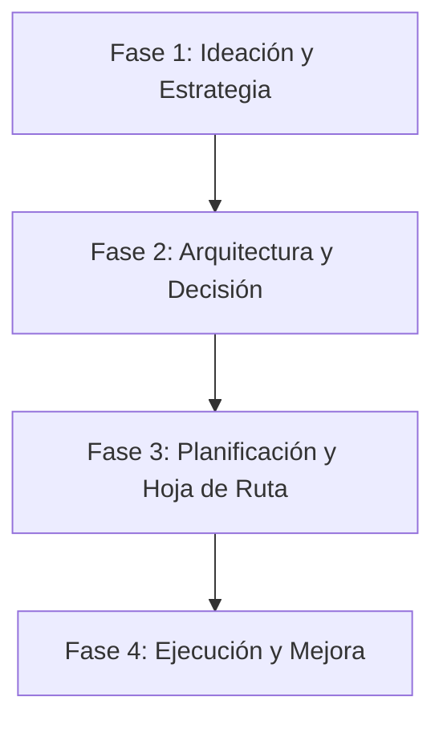

# 🧠 Playbook de Estrategia y Arquitectura

> **"Si fallás en planificar, estás planificando fallar."**

Este playbook cubre la capa 'Meta' del desarrollo de software: decidir _qué_ construir, _por qué_ construirlo y _cómo_ diseñarlo arquitectónicamente antes de escribir una sola línea de código.

---

## 🚀 El Ciclo de Vida de la Visión a la Ejecución

El excelente software comienza en una pizarra, no en un IDE.

### 💡 Fase 1: Ideación y Estrategia (El "Por qué")

_Objetivo: Validar la idea y definir el valor._

1.  **Desbloquear la Creatividad**: Usá **[`brainstorming`](brainstorming/SKILL.md)** para generar ideas o resolver bloqueos.
    - _Técnicas_: SCAMPER, Primeros Principios, Inversión.

2.  **Diseñar el Control de Flujo**: Usá **[`design-orchestration`](design-orchestration/SKILL.md)** para enrutar diseños a través de tormentas de ideas, revisiones y chequeos de preparación para la ejecución.

3.  **Definir el Mercado**: Usá **[`marketing-ideas`](marketing-ideas/SKILL.md)** y **[`pricing-strategy`](pricing-strategy/SKILL.md)** temprano.
    - _Regla_: Si no podés definir quién paga o cómo paga, todavía no tenés un producto.

4.  **Prototipar Rápido**: Usá **[`app-builder`](app-builder/SKILL.md)** para mapear el MVP.
    - _Enfoque_: Únicamente la Propuesta de Valor Core. Todo lo demás es distracción.

5.  **Orquestación de Multi-Skills**: Usá **[`antigravity-workflows`](antigravity-workflows/SKILL.md)** para ejecutar flujos de trabajo estructurados (entrega de SaaS MVP, QA, seguridad, etc.) encadenando múltiples skills especializadas.

### 🏗️ Fase 2: Arquitectura y Decisión (El "Qué")

_Objetivo: Diseñar un sistema que sobreviva al éxito._

1.  **Diseño de Sistemas**: Usá **[`senior-architect`](senior-architect/SKILL.md)** o el framework general de **[`architecture`](architecture/SKILL.md)**.
    - _Entregables_: Diagramas C4, ERDs, Registros de Decisión Tecnológica (ADRs).
    - _Mentalidad_: Analizar pros y contras (trade-offs). "Microservicios" no siempre es la respuesta.

2.  **Seleccionar Patrones**: Aplicá **[`architecture-patterns`](architecture-patterns/SKILL.md)** para arquitectura Hexagonal/Limpia y reglas de Domain-Driven Design (DDD).

3.  **Multi-Tenancy**: Usá **[`saas-multi-tenant`](saas-multi-tenant/SKILL.md)** para aislar las bases de datos de los clientes.

### 📅 Fase 3: Planificación y Hoja de Ruta (El "Cuándo")

_Objetivo: Crear un camino realista hacia la entrega._

1.  **Desglosar**: Usá **[`plan-writing`](../product-building/plan-writing/SKILL.md)** para hojas de ruta a nivel de código o seguí el **modo de planificación nativo de Antigravity** (`implementation_plan.md` / `task.md`).

### 🔄 Fase 4: Ejecución y Mejora (El "Cómo")

_Objetivo: Mejorar todos los días._

1.  **Mejora Continua**: Usá **[`kaizen`](kaizen/SKILL.md)**.
    - _Workflow_: Retrospectivas regulares. Corregí el _proceso_, no solo el _bug_.

---

## 📚 Índice de Skills

| Skill | Área de Enfoque | Cuándo usar |
| :--- | :--- | :--- |
| **[`senior-architect`](senior-architect/)** | Diseño de Sistemas | Decisiones de alto nivel, análisis de trade-offs, diagramas |
| **[`architecture`](architecture/)** | Decisiones | Documentación de decisiones de diseño de sistemas usando ADRs |
| **[`architecture-patterns`](architecture-patterns/)** | Patrones | Patrones Hexagonales, Clean y DDD |
| **[`saas-multi-tenant`](saas-multi-tenant/)** | Multi-Tenancy | Aislamiento de bases de datos y esquemas de tenants |
| **[`brainstorming`](brainstorming/)** | Creatividad | Desbloquear problemas, generar ideas de features |
| **[`design-orchestration`](design-orchestration/)** | Orquestación | Enrutar y revisar flujos de diseño (ideación, revisión, ejecución) |
| **[`antigravity-workflows`](antigravity-workflows/)** | Meta-Workflows | Orquestación guiada de multi-skills (MVP, QA, seguridad, agent-builds) |
| **[`app-builder`](app-builder/)** | MVP | Guía de extremo a extremo para construir nuevas aplicaciones |
| **[`pricing-strategy`](pricing-strategy/)** | Negocios | Determinación de modelos de monetización |
| **[`marketing-ideas`](marketing-ideas/)** | Crecimiento | Estrategias de go-to-market |
| **[`kaizen`](kaizen/)** | Procesos | Mejorar los flujos del equipo y la eficiencia personal |
