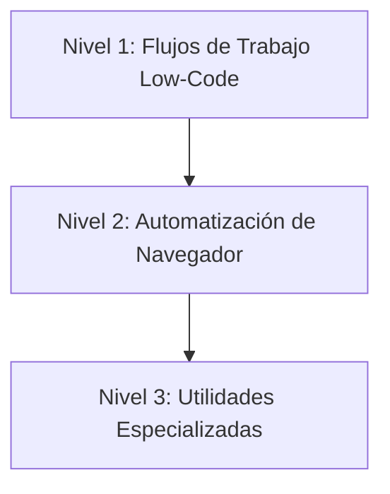

# 🛠️ Playbook de Herramientas y Automatización

> **"Si tenés que hacerlo más de dos veces, automatizalo."**

Este playbook cubre el departamento de "Trabajo Mecánico" de tu stack. Estas skills sirven para construir los robots que hacen el trabajo aburrido para que los humanos no tengan que hacerlo.

---

## 🦾 El Espectro de la Automatización

Elegí la herramienta adecuada para el trabajo. No uses un navegador cuando exista una API. No escribas código cuando baste con un flujo low-code.

### ⚡ Nivel 1: Flujos de Trabajo Low-Code (El Pegamento)

_Objetivo: Conectar APIs rápidamente sin mantener servidores._

1.  **Orquestación de Workflows**: Usá **[`n8n-workflow-builder`](n8n-workflow-builder/SKILL.md)**.
    - _Ideal Para_: Webhooks, conectar SaaS (Slack -> Sheets), tareas programadas (cron).
    - _Ejemplo_: **[`meli-n8n-crm-logger`](meli-n8n-crm-logger/SKILL.md)** muestra cómo registrar datos de comercio electrónico de alto volumen sin escribir un backend.
    - _Scripting en n8n_: Usá **[`n8n-code-javascript`](n8n-code-javascript/SKILL.md)** para escribir lógica personalizada de JavaScript dentro de nodos Code de n8n (gestión de alcances de items, anidamiento de webhooks y fechas con Luxon).
    - _Patrones Arquitectónicos_: Aplicá **[`n8n-workflow-patterns`](n8n-workflow-patterns/SKILL.md)** para seleccionar la estructura correcta (procesamiento de webhooks, integraciones de API, tareas programadas, sincronización de bases de datos o configuraciones de agentes de IA) antes de construir.

2.  **Gestión de APIs**: Usá **[`linear-expert`](linear-expert/SKILL.md)** para programar la sincronización de tareas entre commits del código y tableros de Linear mediante GraphQL.

3.  **Automatización de GitHub MCP**: Usá **[`github-automation`](github-automation/SKILL.md)** para interactuar con repositorios, issues, pull requests y ramas directamente a través de Rube MCP.

### 🕸️ Nivel 2: Automatización de Navegador y Revisiones (El Trabajo Pesado)

_Objetivo: Interactuar con sitios web que no tienen APIs, o automatizar revisiones._

1.  **Scraping y Control**: Usá **[`browser-automation-expert`](browser-automation-expert/SKILL.md)**.
    - _Principio_: Resiliencia > Velocidad.
    - _Técnica_: Usá siempre esperas explícitas (`waitForSelector`). Nunca confíes en un `sleep()` fijo.

2.  **QA y Pruebas E2E**: Consultá **[`e2e-testing-patterns`](e2e-testing-patterns/SKILL.md)** para estructurar suites con Playwright.

3.  **Revisión del Linter Cognitivo**: Usá **[`pr-review`](pr-review/SKILL.md)** para analizar automáticamente el diff de git contra patrones de convenciones, seguridad, corrección y rendimiento.

4.  **Revisión de Código por Humanos**: Usá **[`vibers-code-review`](vibers-code-review/SKILL.md)** para solicitar feedback humano de PR y chequeos de cumplimiento de especificaciones.

5.  **Automatización de Workflows de GitHub**: Usá **[`github-workflow-automation`](github-workflow-automation/SKILL.md)** para configurar revisiones automáticas de PR, etiquetas de triaging de issues y triggers inteligentes de CI/CD.

6.  **Plantillas de GitHub Actions**: Usá **[`github-actions-templates`](github-actions-templates/SKILL.md)** para configuraciones listas para producción de workflows de CI/CD reutilizables, dockerización, despliegue en EKS y escaneo de seguridad.

7.  **Generador de Descripciones de PR**: Usá **[`git-pr-review`](git-pr-review/SKILL.md)** para analizar el historial de commits locales y generar títulos y descripciones estructuradas de PR con un consumo mínimo de tokens.

### 📄 Nivel 3: Utilidades Especializadas y Docs

_Objetivo: Manejar formatos de archivo complejos y mantener la arquitectura de la documentación._

1.  **Generación de Documentos**: Usá **[`pdf-official`](pdf-official/SKILL.md)** para facturación o informes en PDF.

2.  **Arquitectura de Documentación**: Usá **[`docs-architect`](docs-architect/SKILL.md)** para compilar manuales de referencia técnica masivos de bases de código.

3.  **Higiene del Repositorio**: Usá **[`documentation-expert`](documentation-expert/SKILL.md)** para generar automáticamente archivos README, CHANGELOG y AGENTS.md.
    - _Generador de README_: Aplicá **[`readme`](readme/SKILL.md)** para redactar o actualizar archivos README.md sumamente minuciosos, estructurados y listos para copiar y pegar para configuración local, mapas de arquitectura y despliegues.
    - _Sincronización de Documentación_: Aplicá **[`docs-sync`](docs-sync/SKILL.md)** para analizar cambios en el código y actualizar archivos de conocimiento desactualizados automáticamente al cerrar un epic.

4.  **Síntesis de Sistemas de Diseño**: Usá **[`design-md`](design-md/SKILL.md)** para analizar proyectos Stitch vía MCP y compilar sistemas de diseño en archivos `DESIGN.md`.

5.  **Diagnósticos Postmortem de Sesiones**: Usá **[`analyze-project`](analyze-project/SKILL.md)** para analizar registros de sesiones de programación, causas raíz de retrabajo (churn) e identificar subsistemas frágiles.

---

## 📚 Índice de Skills

| Skill | Área de Enfoque | Cuándo usar |
| :--- | :--- | :--- |
| **[`n8n-workflow-builder`](n8n-workflow-builder/)** | Low-Code | Conectar APIs, workflows orientados a eventos, tareas programadas (cron) |
| **[`n8n-code-javascript`](n8n-code-javascript/)** | Scripting | Escribir JavaScript personalizado dentro de nodos Code de n8n |
| **[`n8n-workflow-patterns`](n8n-workflow-patterns/)** | Arquitectura | Estructuras arquitectónicas principales y patrones de enrutamiento en n8n |
| **[`browser-automation-expert`](browser-automation-expert/)** | Scraping | Automatizar interacciones web, pruebas, extracción de datos |
| **[`meli-n8n-crm-logger`](meli-n8n-crm-logger/)** | E-commerce | Receta específica para el registro de CRM en MercadoLibre |
| **[`linear-expert`](linear-expert/)** | Sincronización API | Programar issues, tareas y hojas de ruta en Linear |
| **[`pr-review`](pr-review/)** | Revisión de Código | Linter cognitivo para auditar corrección, tests, seguridad y rendimiento en diffs de git |
| **[`vibers-code-review`](vibers-code-review/)** | Revisión de Código | Workflow estándar para revisiones de PR basadas en especificaciones de humanos |
| **[`git-pr-review`](git-pr-review/)** | Descripción de PR | Analizador del historial de commits locales para redactar descripciones de PR |
| **[`e2e-testing-patterns`](e2e-testing-patterns/)** | Pruebas E2E | Diseñar suites de pruebas con Playwright |
| **[`pdf-official`](pdf-official/)** | Documentos | Generar y manipular archivos PDF |
| **[`docs-architect`](docs-architect/)** | Docs de Arquitectura | Compilar manuales de referencia detallados de bases de código |
| **[`documentation-expert`](documentation-expert/)** | Higiene del Repo | Automatizar README, CHANGELOG, AGENTS y la base de conocimiento `.knowledge/` |
| **[`readme`](readme/)** | Higiene del Repo | Generación y mapeo de estructura de READMEs ridículamente detallados |
| **[`docs-sync`](docs-sync/)** | Sincronización | Sincronización quirúrgica de documentación al cerrar un epic |
| **[`design-md`](design-md/)** | Sistemas de Diseño | Sintetizar proyectos de Stitch en archivos DESIGN.md |
| **[`github-workflow-automation`](github-workflow-automation/)** | CI/CD y Revisiones | Automatizar workflows de GitHub con Actions y asistencia de IA |
| **[`github-actions-templates`](github-actions-templates/)** | Plantillas de CI/CD | Patrones listos para producción de workflows de GitHub Actions |
| **[`analyze-project`](analyze-project/)** | Diagnósticos Forenses | Análisis postmortem de retrabajo (churn) y hotspots de sesiones de desarrollo |
| **[`github-automation`](github-automation/)** | API / MCP | Gestión programática de repositorios, issues y PRs mediante Rube MCP |
