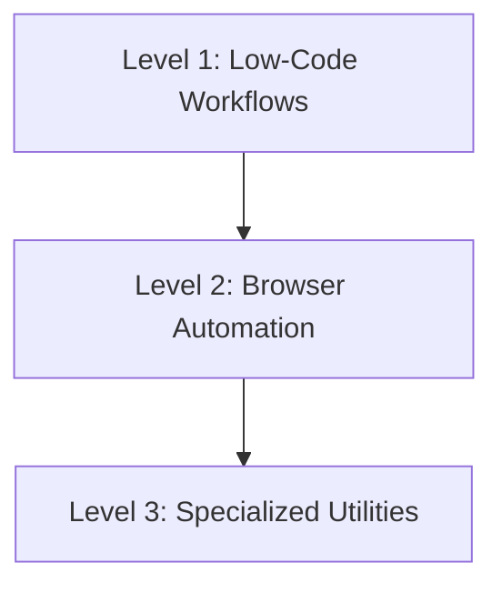

# 🛠️ Tools & Automation Playbook

> **"If you have to do it more than twice, automate it."**

This playbook covers the "Machine Labor" department of your stack. These skills are for building the robots that do the boring work so humans don't have to.

---

## 🦾 The Automation Spectrum

Choose the right tool for the job. Do not use a browser when an API exists. Do not write code when a low-code flow suffices.

### ⚡ Level 1: Low-Code Workflows (The Glue)

_Goal: Connect APIs quickly without maintaining servers._

1.  **Workflow Orchestration**: Use **[`n8n-workflow-builder`](n8n-workflow-builder/SKILL.md)**.
    - _Best For_: Webhooks, connecting SaaS (Slack -> Sheets), Cron jobs.
    - _Example_: **[`meli-n8n-crm-logger`](meli-n8n-crm-logger/SKILL.md)** shows how to log high-volume e-commerce data without writing a backend.
    - _Scripting in n8n_: Use **[`n8n-code-javascript`](n8n-code-javascript/SKILL.md)** to write custom JavaScript logic within n8n Code nodes (managing item scopes, webhook nesting, and Luxon dates).
    - _Architectural Patterns_: Apply **[`n8n-workflow-patterns`](n8n-workflow-patterns/SKILL.md)** to select the right structure (webhook processing, API integrations, scheduled tasks, database sync, or AI agent setups) before building.

2.  **API Management**: Use **[`linear-expert`](linear-expert/SKILL.md)** to script task synchronization between codebase commits and Linear boards via GraphQL.

3.  **GitHub MCP Automation**: Use **[`github-automation`](github-automation/SKILL.md)** to interact with repositories, issues, pull requests, and branches directly via Rube MCP.

### 🕸️ Level 2: Browser & Review Automation (The Heavy Lifting)

_Goal: Interact with websites that don't have APIs, or automate reviews._

1.  **Scraping & Control**: Use **[`browser-automation-expert`](browser-automation-expert/SKILL.md)**.
    - _Principle_: Resiliency > Speed.
    - _Technique_: Always use explicit waits (`waitForSelector`). Never rely on fixed `sleep()`.

2.  **QA & E2E Testing**: Reference **[`e2e-testing-patterns`](e2e-testing-patterns/SKILL.md)** for Playwright structures.

3.  **Human Code Review**: Use **[`vibers-code-review`](vibers-code-review/SKILL.md)** to request human PR feedback and compliance checks.

4.  **GitHub Workflow Automation**: Use **[`github-workflow-automation`](github-workflow-automation/SKILL.md)** to configure automated PR reviews, issue triage labels, and smart CI/CD triggers.

5.  **GitHub Actions Templates**: Use **[`github-actions-templates`](github-actions-templates/SKILL.md)** for production-ready, reusable CI/CD workflows, dockerization, EKS deployment, and security scanning configs.

6.  **Git PR Description Generator**: Use **[`git-pr-review`](git-pr-review/SKILL.md)** to analyze local commit histories and generate structured PR titles and descriptions with minimal token usage.

### 📄 Level 3: Specialized Utilities & Docs

_Goal: Handle complex file formats and maintain document architecture._

1.  **Document Generation**: Use **[`pdf-official`](pdf-official/SKILL.md)** for PDF invoicing or reporting.

2.  **Documentation Architecture**: Use **[`docs-architect`](docs-architect/SKILL.md)** for compiling massive codebase technical reference manuals.

3.  **Repository Hygiene**: Use **[`documentation-expert`](documentation-expert/SKILL.md)** to generate project README, CHANGELOG, and AGENTS.md files.

4.  **Design System Synthesis**: Use **[`design-md`](design-md/SKILL.md)** to analyze Stitch projects via MCP and compile design systems into `DESIGN.md` files.

5.  **Session Postmortem Diagnostics**: Use **[`analyze-project`](analyze-project/SKILL.md)** to analyze coding session logs, root causes of churn, and identify fragile subsystems.

---

## 📚 Skill Index

| Skill | Focus Area | When to use |
| :--- | :--- | :--- |
| **[`n8n-workflow-builder`](n8n-workflow-builder/)** | Low-Code | Connecting APIs, event-driven workflows, cron jobs |
| **[`n8n-code-javascript`](n8n-code-javascript/)** | Scripting | Writing custom JavaScript inside n8n Code nodes |
| **[`n8n-workflow-patterns`](n8n-workflow-patterns/)** | Architecture | Core architectural structures and routing patterns in n8n |
| **[`browser-automation-expert`](browser-automation-expert/)** | Scraping | Automating web interactions, testing, scraping data |
| **[`meli-n8n-crm-logger`](meli-n8n-crm-logger/)** | E-commerce | Specific recipe for MercadoLibre CRM logging |
| **[`linear-expert`](linear-expert/)** | API Sync | Scripting issues, tasks, and roadmaps in Linear |
| **[`vibers-code-review`](vibers-code-review/)** | Code Review | Standard workflow for human spec-based PR reviews |
| **[`git-pr-review`](git-pr-review/)** | PR Description | Local commit history analyzer for PR description drafting |
| **[`e2e-testing-patterns`](e2e-testing-patterns/)** | E2E Testing | Designing Playwright test suites |
| **[`pdf-official`](pdf-official/)** | Documents | Generating and manipulating PDF files |
| **[`docs-architect`](docs-architect/)** | Architecture Docs | Compiling deep codebase reference manuals |
| **[`documentation-expert`](documentation-expert/)** | Repo Hygiene | Automating README, CHANGELOG, and AGENTS.md |
| **[`design-md`](design-md/)** | Design Systems | Synthesizing Stitch projects into DESIGN.md files |
| **[`github-workflow-automation`](github-workflow-automation/)** | CI/CD & Review | Automating GitHub workflows with Actions and AI assistance |
| **[`github-actions-templates`](github-actions-templates/)** | CI/CD Templates | Production-ready GitHub Actions workflow patterns |
| **[`analyze-project`](analyze-project/)** | Forensic Diagnostics | Postmortem analysis of coding session churn and hotspots |
| **[`github-automation`](github-automation/)** | API / MCP | Programmatic repository, issue, and PR management via Rube MCP |
