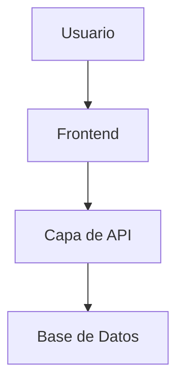

# Plantilla de README

## Nombre del Proyecto
*Descripción corta y atractiva del proyecto.*

## Propuesta de Valor
*Explicá qué problema resuelve este proyecto y por qué es importante.*

## Stack Tecnológico
*Listá las tecnologías principales utilizadas.*
- **Frontend**: [ej: Next.js, React, Tailwind]
- **Backend**: [ej: Node.js, Prisma, PostgreSQL]
- **Integración de Agente de IA**: [ej: Antigravity Skill, n8n]
- **Infraestructura**: [ej: Vercel, Docker]

## Inicio Rápido
*Instrucciones de instalación y configuración.*
```bash
git clone <repository-url>
cd <project-folder>
npm install
npm run dev
```

## Estructura del Proyecto
*Resumen de alto nivel de las carpetas y archivos más importantes.*
- `src/`: Código principal de la aplicación.
- `public/`: Assets y archivos públicos.
- `.agent/`: Workflows y configuraciones relacionadas con agentes.

## Arquitectura
*Descripción de alto nivel o diagrama de Mermaid del sistema.*


## Contribuciones
*Mención breve de las pautas de contribución, apuntando a CONTRIBUTING.md.*

---
*Generado por el Skill de Experto en Documentación*
